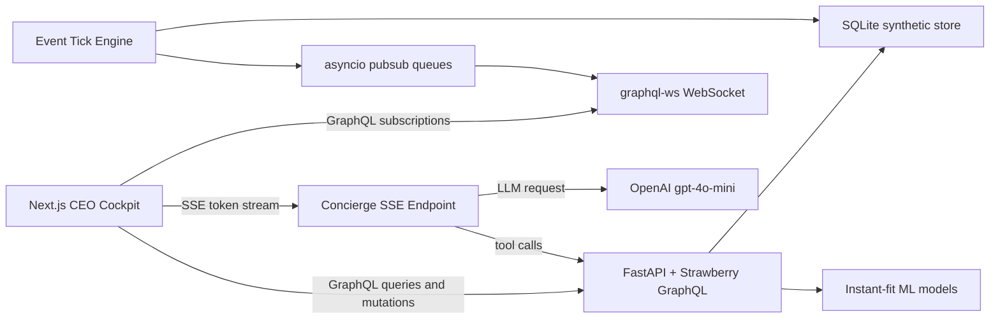

# Architecture

Xlr8 is a local-first hackathon prototype for a CEO-grade Indian hospital command cockpit.

## System Shape

## Core Decisions

- GraphQL is the main API surface for dashboard data, mutations, and real-time subscriptions.
- SSE is used only for OpenAI token streaming because chat token streams are simpler and more reliable outside GraphQL.
- SQLite is used for prototype speed and reproducible local demos.
- Synthetic data models a large Indian hospital chain across facilities, departments, TPAs, NABH indicators, licenses, doctors, nurses, machines, and supplies.

## Data Flow

1. `data_gen.seed` creates 90 days of realistic history.
2. FastAPI starts, loads SQLite, fits instant models, and starts the tick engine.
3. Frontend queries initial GraphQL snapshots.
4. Tick engine mutates live entities and publishes events to subscription queues.
5. Apollo Client receives subscription events and updates visible tiles.
6. Concierge executes persisted GraphQL operations as tools and returns cited answers.

## Runtime Ports

- Frontend: `http://localhost:3000`
- Backend: `http://localhost:8000`
- GraphQL: `http://localhost:8000/graphql`
- Concierge stream: `POST http://localhost:8000/api/concierge/stream`
